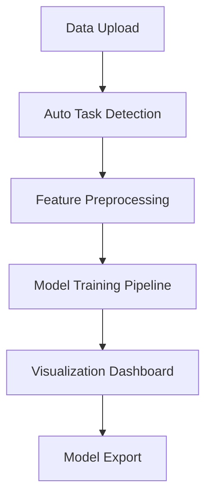

# The Future of Interactive ML: Building Human-Centered Machine Learning Apps with Streamlit

An in-depth exploration of the rise of human-centered, interactive machine learning. This article examines how Streamlit enables collaborative AI design by merging UX, visualization, and automation. Includes theory, architecture, and design insights from the ML Playground project by Amir Hossein Honardoust.

---

## Abstract

As artificial intelligence evolves from rigid, code-centric systems to adaptive, collaborative environments, **interactivity** has become a defining feature of modern machine learning. This article explores how **Streamlit**, a Python-based web app framework, bridges human creativity and algorithmic intelligence, enabling data scientists to design **human-centered machine learning interfaces**. Through the lens of the *ML Playground* project, we examine how thoughtful UI, explainability, and automation redefine the relationship between humans and AI systems.

---

## 1. Introduction, Why Human-Centered ML Matters

For years, machine learning was a black box: accessible only to coders who spoke the language of math and code. But today, as AI systems increasingly influence real-world decisions, **human-centered design** has become essential. The challenge is no longer just “Can we build an accurate model?”, it’s **“Can humans understand, trust, and control it?”**

Enter **interactive ML**, a paradigm where AI systems are *exploratory, explainable, and collaborative*. Tools like Streamlit enable users to ask questions, visualize patterns, tweak parameters, and instantly see outcomes. This loop of interaction transforms static models into *living systems of insight*.

---

## 2. The Human-Centered AI Paradigm

Human-Centered AI (HCAI) combines **human-computer interaction (HCI)**, **ethical design**, and **machine learning**. Its goal: amplify human potential, not replace it.

According to Ben Shneiderman’s *“Human-Centered AI Manifesto”* (2020), successful AI systems must be:
1. **Reliable and Safe**
2. **Understandable and Transparent**
3. **Controllable by Humans**

From Shneiderman to Amershi et al. (Microsoft Research, 2019), scholars emphasize that AI must support **iterative feedback** between human intent and algorithmic output. Streamlit embodies these principles: it places *control* in the hands of users without forcing them to learn web development or API design.

---

## 3. Streamlit, The Interface Revolution

Streamlit emerged in 2019 as a radical idea: “What if machine learning apps were as easy to build as Python scripts?” Unlike Dash or Flask, Streamlit does not require HTML, CSS, or complex server logic. It allows **data scientists to build full-fledged interactive tools in minutes.**

```python
import streamlit as st
import pandas as pd
import plotly.express as px

st.title("Interactive ML Example")
file = st.file_uploader("Upload your data")
if file:
    df = pd.read_csv(file)
    st.write(df.head())
    st.plotly_chart(px.scatter(df, x=df.columns[0], y=df.columns[1]))
```

This single script creates a data exploration interface, no front-end code needed. It democratizes access to machine learning, turning experimentation into interaction.

---

## 4. Case Study: Designing the ML Playground

The *ML Playground* project demonstrates how Streamlit can be used to build a **self-adaptive ML environment**. It automatically detects task type (classification vs regression), constructs preprocessing pipelines, trains models, and visualizes metrics.

### Architecture Overview


### Design Principles
- **Simplicity:** One-page app with automatic configuration.
- **Explainability:** Live feedback on model metrics.
- **Version Safety:** Handles `sparse_output` vs `sparse` gracefully.
- **Visual Feedback:** ROC curves, residual plots, confusion matrices.

By combining **scikit-learn pipelines**, **Plotly visualizations**, and **Streamlit’s reactivity**, the app embodies the future of “human-in-the-loop” ML.

---

## 5. The Psychology of Interactivity

Cognitive research shows that *active engagement* improves understanding and memory retention. When users **see** and **manipulate** model behavior in real-time, their trust in the system increases.

### Why Interactivity Matters
- **Transparency:** Users understand model limits.
- **Control:** Analysts can test “what if” scenarios.
- **Learning:** Visualizations turn abstract metrics into tangible intuition.

For instance, a dynamic ROC curve doesn’t just measure performance, it *teaches* users how sensitivity and specificity interact. Similarly, residual plots make model error distributions visually meaningful.

---

## 6. Building Trust Through Explainability

In modern AI ethics, **explainability** equals accountability. Streamlit apps like ML Playground promote interpretability by combining data visualization with contextual information. Instead of blind outputs, users receive *narrative insights*.

```text
Model: RandomForestRegressor
R² Score: 0.89, Strong model fit.
Interpretation: Model explains ~89% of variance in the data.
```

Future systems will go further, embedding **natural language explanations** into every chart or metric, closing the cognitive gap between data science and decision-making.

---

## 7. The Road to Democratized AI

Interactive ML is not a niche, it’s the **future of data-driven decision systems**. We’re moving from “code-first” to **“experience-first” AI**.

### Key Trends Ahead
1. **Conversational ML Apps** | LLM-powered assistants that explain results dynamically.  
2. **Explainable-by-Design Interfaces** | models that narrate their reasoning.  
3. **Multimodal ML** | Streamlit apps combining text, vision, and audio pipelines.  
4. **Collaborative Dashboards** | multiple users interacting with shared AI environments.  
5. **Agentic Systems** | self-updating, self-evaluating Streamlit agents powered by GPT backends.

Interactive frameworks like Streamlit will underpin this transformation, making AI development **as intuitive as storytelling**.

---

## 8. Conclusion, Building AI That Talks Back

The future of AI is *not just smarter algorithms*, it’s **smarter interactions**. By merging machine learning, visualization, and user experience, tools like Streamlit enable AI systems to “talk back” to explain, adapt, and collaborate.

Human-centered ML is more than an engineering goal; it’s a design philosophy. It reminds us that technology’s true purpose is not automation, it’s **amplification** of human potential.

---

## Annotated References & Attributions

1. **Ben Shneiderman**, *Human-Centered AI Manifesto* (2020).  
2. **Saleema Amershi et al.**, *Guidelines for Human-AI Interaction*, Microsoft Research (2019).  
3. **Streamlit Docs**, *Streamlit Official Documentation*, streamlit.io/docs.  
4. **Plotly Express**, *Interactive Visualization Library*, plotly.com/python.  
5. **scikit-learn**, *Machine Learning in Python*, scikit-learn.org.  
6. **ML Playground (2025)**, by Amir Hossein Honardoust, GitHub.
7. **Bostrom, N.**, *Superintelligence: Paths, Dangers, Strategies*, Oxford Press, 2014.  
8. **Norman, D.**, *The Design of Everyday Things*, MIT Press, 2013.
